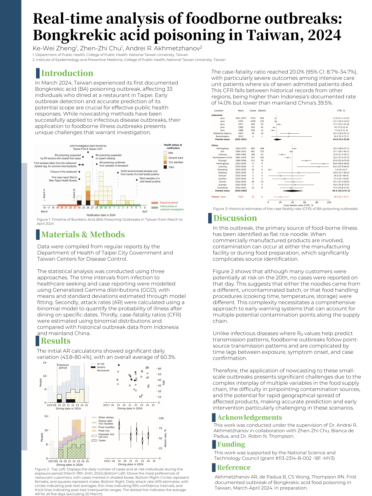

In March 2024, Taiwan experienced its first documented Bongkrekic acid
(BA) poisoning outbreak, affecting 33 individuals who dined at a
restaurant in Taipei. This outbreak was analyzed with a separate set of
methods from the GMITS forecasting work shown elsewhere on this site
(Generalized Gamma delay distributions, binomial attack-rate and
case-fatality-ratio models), and the results were presented as a poster
at the 35th Annual Meeting of the Japan Epidemiological Society.

This is posted at the The 35th Annual Scientific Meeting of the Japan Epidemiological Association.
Poster number:PO2-7-7

You can access the poster list at the following link:
https://jeaweb.jp/files/activities/annual_meetings/35-kouenshu.pdf

I served as the secondary author,mainly participated to perform data cleaning, visualizing, and attack rate estimating.

*Zheng KW, Chu ZZ, Akhmetzhanov AR. Real-time analysis of foodborne
outbreaks: Bongkrekic acid poisoning in Taiwan, 2024.*

Click the poster above to view the full-resolution [PDF](bongkrek_poster.pdf).

## Summary

**Introduction.** Early outbreak detection and accurate prediction of
its potential scope are crucial for effective public health responses.
While nowcasting methods have been successfully applied to infectious
disease outbreaks, their application to foodborne illness outbreaks
presents unique challenges: unlike infectious diseases, where R₀ values
help predict transmission, foodborne outbreaks follow point-source
transmission patterns and are complicated by time lags between
exposure, symptom onset, and case confirmation.

**Materials & Methods.** Data were compiled from regular reports by the
Department of Health of Taipei City Government and Taiwan CDC. Three
approaches were used: (1) time intervals from infection to healthcare
seeking and case reporting were modelled with Generalized Gamma
distributions; (2) attack rates (AR) were estimated with a binomial
model to quantify the probability of illness after dining on specific
dates; (3) case-fatality ratios (CFR) were estimated with binomial
distributions and compared against historical outbreak data from
Indonesia and mainland China.

**Results.** Daily attack rates varied substantially (43.8–80.4%), with
an overall average of 60.3%. The source was identified as flat rice
noodle; notably, although many customers were potentially at risk on
March 20th, no cases were reported that day, suggesting either an
uncontaminated batch or differences in food handling (cooking time,
temperature, storage). The case-fatality ratio reached 20.0% (95% CI:
8.7–34.7%), with particularly severe outcomes among ICU patients (six
of seven admitted patients died) — between Indonesia's historical rate
(14.0%) and mainland China's (39.5%).

**Discussion.** Because commercially manufactured products can be
contaminated at either the manufacturing facility or during food
preparation, source identification is significantly complicated.
Applying nowcasting to small-scale, point-source foodborne outbreaks is
inherently harder than for infectious diseases: multiple potential
contamination points along the supply chain, difficulty pinpointing the
source, and the potential for rapid geographical spread of affected
products all make early warning and intervention more challenging.

## Credits

This work was conducted under the supervision of Dr. Andrei R.
Akhmetzhanov, in collaboration with Ke-Wei Zheng, Bianca de Padua, and
Dr. Robin N. Thompson. Supported by the National Science and Technology
Council (grant #113-2314-B-002-181-MY3).

Reference: Akhmetzhanov AR, de Padua B, Wong CS, Thompson RN. First
documented outbreak of Bongkrekic acid food poisoning in Taiwan,
March–April 2024. In preparation.
